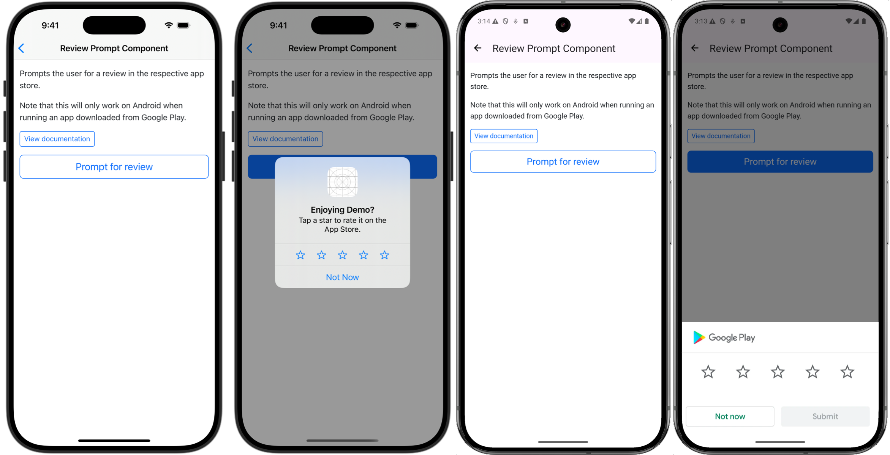
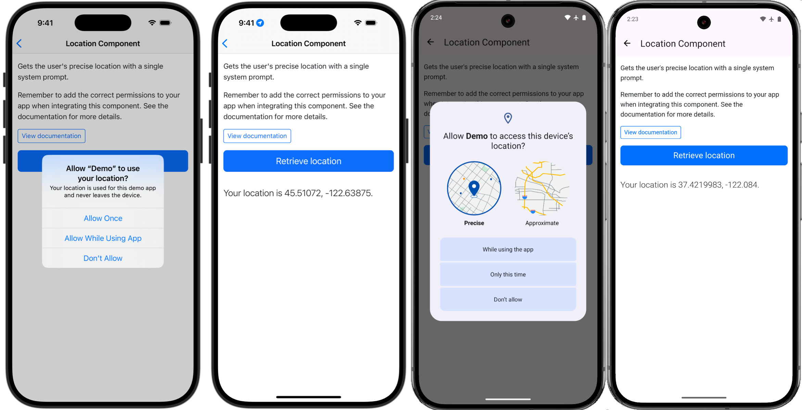
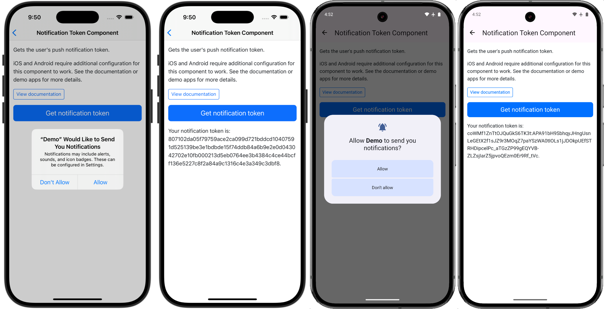

# Bridge Components for Hotwire Native apps

> by [Joe Masilotti](https://masilotti.com), the Hotwire Native guy

[Hotwire Native](https://native.hotwired.dev) enables seamless communication between native Swift and Kotlin code and web views in hybrid mobile apps. [Bridge components](https://native.hotwired.dev/overview/bridge-components) extend this functionality by providing reusable, battle-tested native components that interact effortlessly with Hotwire Native-powered web views. Bridge components enable developers to break out of the web view container and **drive native features**.

This repository contains generalized, production-ready bridge components extracted from [real-world client projects](https://masilotti.com/services/). Once configured, each component can be added to any page of your app and customized with HTML.

## Free components

The source code for these components is included in this repo.

### [Alert Component](components/alert/)

[](components/alert/)

### [Button Component](components/button/)

[](components/button/)

### [Form Component](components/form/)

[](components/form/)

### [Menu Component](components/menu/)

[](components/menu/)

### [Review Prompt Component](components/review-prompt/)

[](components/review-prompt/)

### [Toast Component](components/toast/)

[](components/toast/)

## Paid components

Gain access to these components by [purchasing a Pro license](https://buy.stripe.com/fZeaF6bn9b9d4Pm14b). This is a **one-time payment** and not a subscription. It includes access to all bridge components available today, plus all future updates.

### [Barcode Scanner Component](components/barcode-scanner/)

[](components/barcode-scanner/)

### [Location Component](components/location/)

[](components/location/)

### [Notification Token Component](components/notification-token/)

[](components/notification-token/)

## Installation

To use a bridge component, copy the relevant Swift/Kotlin and JavaScript files from the [`components/` directory](components/) into your project and register the component.

### iOS (Swift)

1. Copy the Swift file (`ExampleComponent.swift`) into your Xcode project.
1. Register the component in `AppDelegate.swift`.

```swift
import HotwireNative
import UIKit

@main
class AppDelegate: UIResponder, UIApplicationDelegate {
    func application(_ application: UIApplication, didFinishLaunchingWithOptions launchOptions: [UIApplication.LaunchOptionsKey: Any]?) -> Bool {
        configureHotwire()
        return true
    }

    private func configureHotwire() {
        Hotwire.registerBridgeComponents([
            ExampleComponent.self
        ])
    }
}
```

### Android (Kotlin)

1. Copy the Kotlin file (`ExampleComponent.kt`) into your Android Studio project.
1. Register the component inside your `Application` subclass.

```kotlin
package com.masilotti.demo // Change to your package name.

import android.app.Application
import com.masilotti.demo.components.ExampleComponent // Import component here.
import dev.hotwire.core.bridge.BridgeComponentFactory
import dev.hotwire.core.bridge.KotlinXJsonConverter
import dev.hotwire.core.config.Hotwire
import dev.hotwire.navigation.config.registerBridgeComponents

class DemoApplication : Application() {
    override fun onCreate() {
        super.onCreate()

        Hotwire.registerBridgeComponents(
            BridgeComponentFactory("example", ::ExampleComponent)
        )
    }
}
```

### Web (JavaScript)

1. Copy the JavaScript file (`example_controller.js`) into `app/javascript/controllers/bridge/`.
1. Import and initialize (if you aren't dynamically importing Stimulus controllers).

```javascript
import { application } from "./application"

import Bridge__ExampleController from "./bridge/example_controller"
application.register("bridge--example", Bridge__ExampleController)
```

## Prerequisites 

### iOS

1. [Hotwire Native iOS](https://native.hotwired.dev/ios/getting-started)

### Android

1. [Hotwire Native Android](https://native.hotwired.dev/android/getting-started)
1. [Jetpack Compose](https://developer.android.com/develop/ui/compose/setup)
1. A serialization library, like [kotlinx.serialization](https://github.com/Kotlin/kotlinx.serialization?tab=readme-ov-file#setup)
1. [Material Symbol](https://fonts.google.com/icons) font if using images
    * Unzip the downloaded font and copy the Outlined version `.ttf` to `app/src/main/res/font/material_symbols.ttf`

Check the [example Android project](examples/android/) for a full working example app.

### Web

1. [Hotwire Native Bridge](https://native.hotwired.dev/reference/bridge-installation)

## Usage

Once installed, use a component by adding a `data-controller` attribute that matches the name of the Stimulus controller.

```html
<div data-controller="bridge--example"></div>
```

Each component can then be configured further - check the README in each component's directory for more information.
