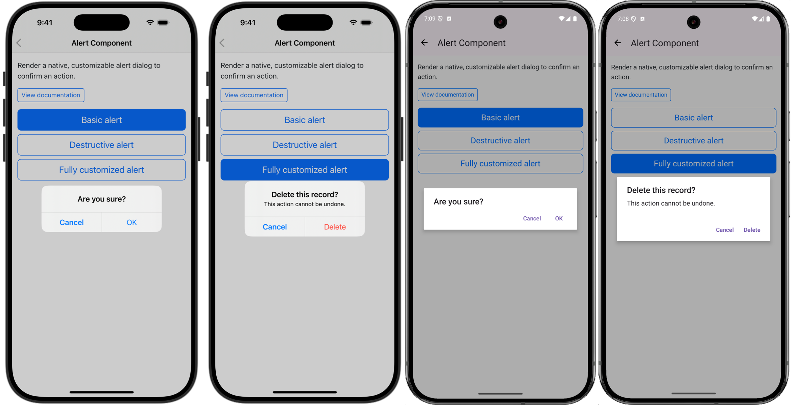
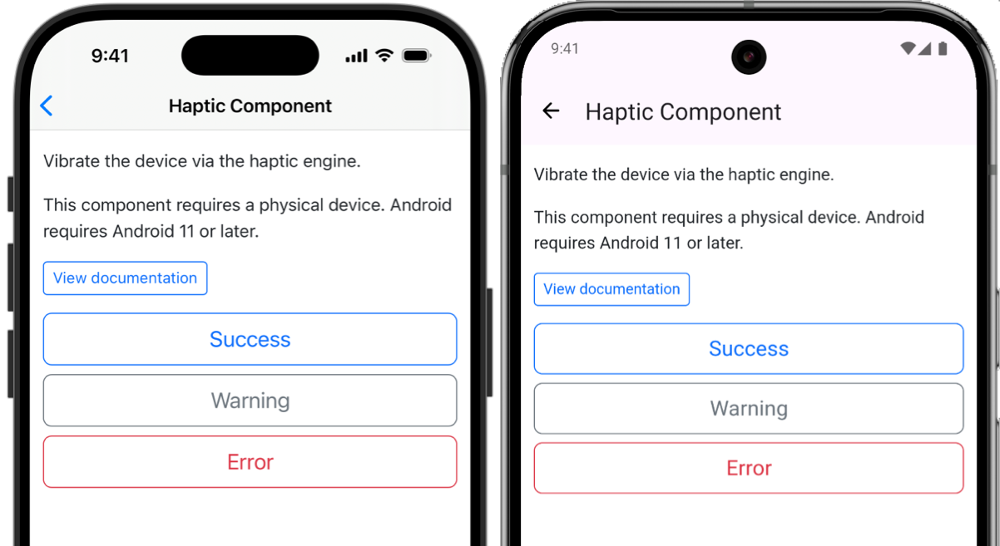
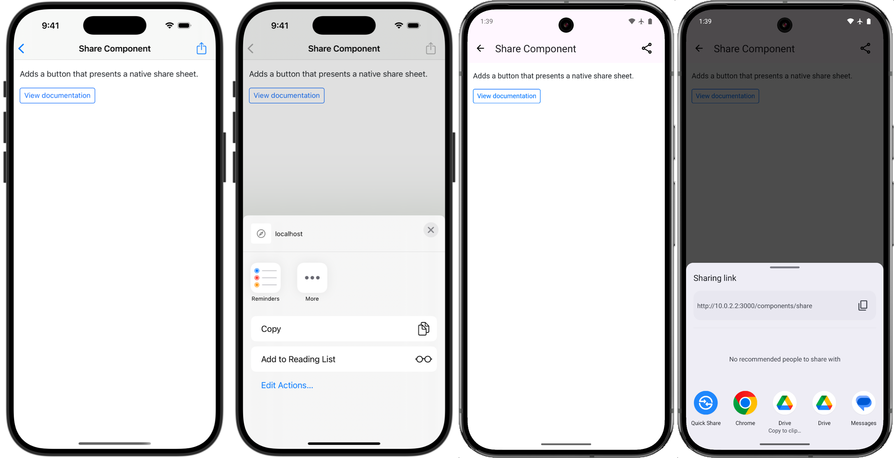
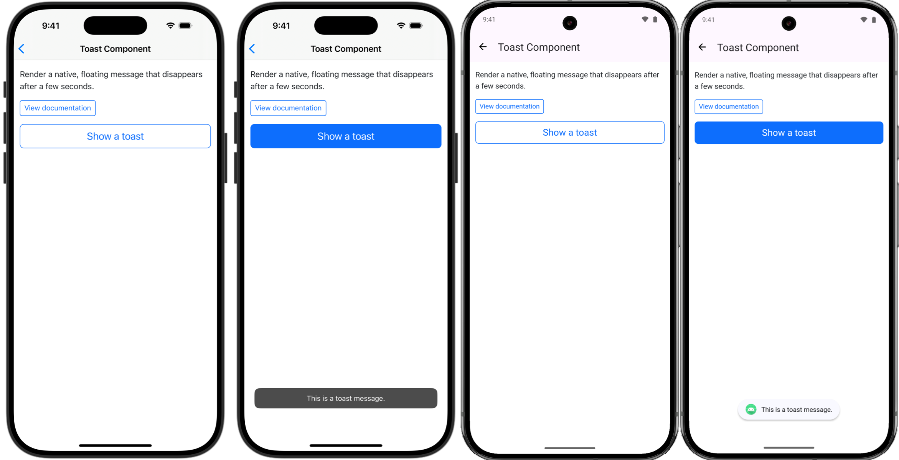
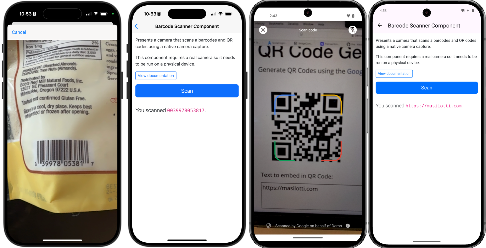
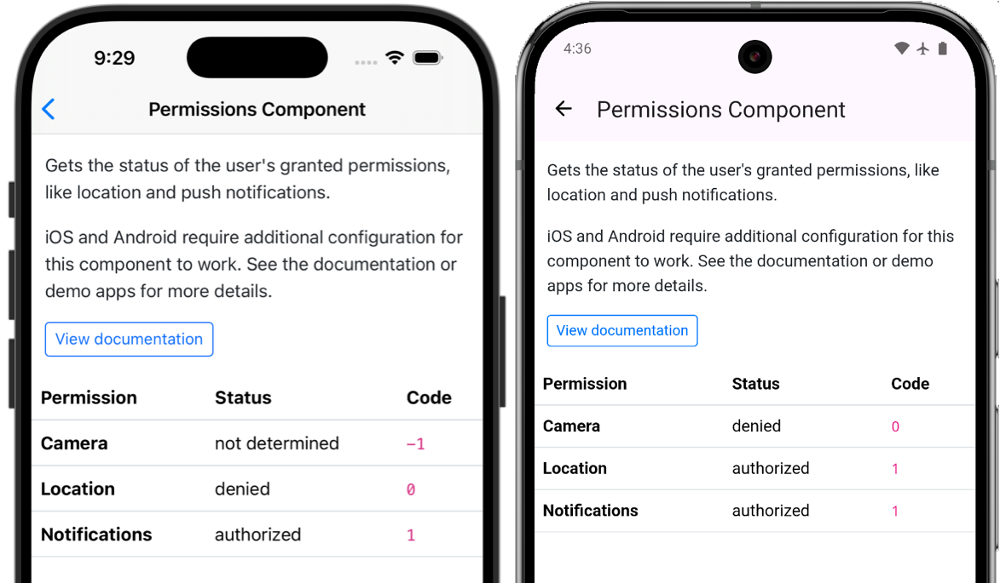

# Bridge Components for Hotwire Native apps

> by [Joe Masilotti](https://masilotti.com), the Hotwire Native guy

[Hotwire Native](https://native.hotwired.dev) enables seamless communication between native Swift and Kotlin code and web views in hybrid mobile apps. [Bridge components](https://native.hotwired.dev/overview/bridge-components) extend this functionality by providing reusable native components that interact your web views. They enable developers to break out of the web view container and **drive native features**.

This repository contains generalized, production-ready bridge components extracted from [real-world client projects](https://masilotti.com/services/). Once configured, each component can be added to any page of your app and customized with a bit of HTML.

## Requirements

* Hotwire Native iOS v1.2 or later
* Hotwire Native Android v1.0 or later
* [Hotwire Native Bridge](https://native.hotwired.dev/reference/bridge-installation) on the web

## Free components

The source code for the iOS, Android, and web components are included in this repo.

### [Alert Component](components/alert/)

Displays a native alert dialog to confirm an action.

[](components/alert/)

### [Button Component](components/button/)

Adds a native button to the navigation bar on iOS and action bar on Android. The button can contain either a text string or an image.

[](components/button/)

### [Form Component](components/form/)

Replaces a form's submit `<button>` with a native one that disables during submission.

[](components/form/)

### [Haptic Component](components/haptic/)

Vibrate the device via the haptic engine.

[](components/haptic/)

### [Menu Component](components/menu/)

Adds a native button to the navigation bar that, when tapped, renders a native menu powered by `UIMenu` on iOS and `DropdownMenu` on Android.

[](components/menu/)

### [Review Prompt Component](components/review-prompt/)

Prompts the user for a review on the App Store on iOS and Google Play on Android.

[](components/review-prompt/)

### [Share Component](components/share/)

Adds a button that presents a native share sheet.

[](components/share/)

### [Toast Component](components/toast/)

Render a native, floating message that disappears after a few seconds.

[](components/toast/)

## Paid components

> [!IMPORTANT]
> Gain access to these components by [purchasing a Pro license](https://buy.stripe.com/fZeaF6bn9b9d4Pm14b). This is a **one-time payment** and not a subscription. It includes access to all bridge components available today, plus all future updates. View the [full pro license](PRO-LICENSE.md) before purchasing.

### [Barcode Scanner Component](components/barcode-scanner/)

Presents a camera that scans barcodes and QR codes using a native camera capture.

[](components/barcode-scanner/)

### [Document Scanner Component](components/document-scanner/)

Presents a camera that digitizes physical documents.

[](components/document-scanner/)

### [Location Component](components/location/)

Prompts the user for their precise location with a single system dialog.

[](components/location/)

### [Notification Token Component](components/notification-token/)

Gets the user's push notification token.

[](components/notification-token/)

### [Permissions Component](components/permissions/)

Gets the status of the user's granted permissions, like location and push notifications.

[](components/permissions/)

## Installation

To use a bridge component, copy the relevant Swift/Kotlin and JavaScript files from the [`components/` directory](components/) into your project and register the component.

Check the [examples directoy](examples/) for full working example iOS, Android, and Rails apps.

### iOS (Swift)

1. Copy the Swift file (`ExampleComponent.swift`) into your Xcode project.
1. Register the component in `AppDelegate.swift`.

```swift
import HotwireNative
import UIKit

@main
class AppDelegate: UIResponder, UIApplicationDelegate {
    func application(_ application: UIApplication, didFinishLaunchingWithOptions launchOptions: [UIApplication.LaunchOptionsKey: Any]?) -> Bool {
        Hotwire.registerBridgeComponents([
            ExampleComponent.self
        ])
        return true
    }
}
```

### Android (Kotlin)

1. Copy the Kotlin file (`ExampleComponent.kt`) into your Android Studio project.
1. Register the component inside your `Application` subclass.

```kotlin
package com.masilotti.demo // Change to your package name.

import android.app.Application
import com.masilotti.demo.components.ExampleComponent // Import component here.
import dev.hotwire.core.bridge.BridgeComponentFactory
import dev.hotwire.core.bridge.KotlinXJsonConverter
import dev.hotwire.core.config.Hotwire
import dev.hotwire.navigation.config.registerBridgeComponents

class DemoApplication : Application() {
    override fun onCreate() {
        super.onCreate()

        Hotwire.registerBridgeComponents(
            BridgeComponentFactory("example", ::ExampleComponent)
        )
    }
}
```

### Web (JavaScript)

1. Copy the JavaScript file (`example_controller.js`) into `app/javascript/controllers/bridge/`.
1. Import and initialize (if you aren't dynamically importing Stimulus controllers).

```javascript
import { application } from "./application"

import Bridge__ExampleController from "./bridge/example_controller"
application.register("bridge--example", Bridge__ExampleController)
```

## Prerequisites

### iOS

1. [Hotwire Native iOS](https://native.hotwired.dev/ios/getting-started)

### Android

1. [Hotwire Native Android](https://native.hotwired.dev/android/getting-started)
1. [Jetpack Compose](https://developer.android.com/develop/ui/compose/setup)
1. A serialization library, like [kotlinx.serialization](https://github.com/Kotlin/kotlinx.serialization?tab=readme-ov-file#setup)
1. [Material Symbol](https://fonts.google.com/icons) font if using images
    * Unzip the downloaded font and copy the Outlined version `.ttf` to `app/src/main/res/font/material_symbols.ttf`

### Web

1. [Hotwire Native Bridge](https://native.hotwired.dev/reference/bridge-installation)

## Usage

Once installed, use a component by adding a `data-controller` attribute that matches the name of the Stimulus controller.

```html
<div data-controller="bridge--example"></div>
```

Each component can then be configured further - check the README in each component's directory for more information.

## Need help?

If you need help installing, configuring, or using the components, feel free to [open a new discussion](https://github.com/joemasilotti/bridge-components/discussions/new?category=q-a) or [send me an email](mailto:joe@masilotti.com). I'd love to help!
